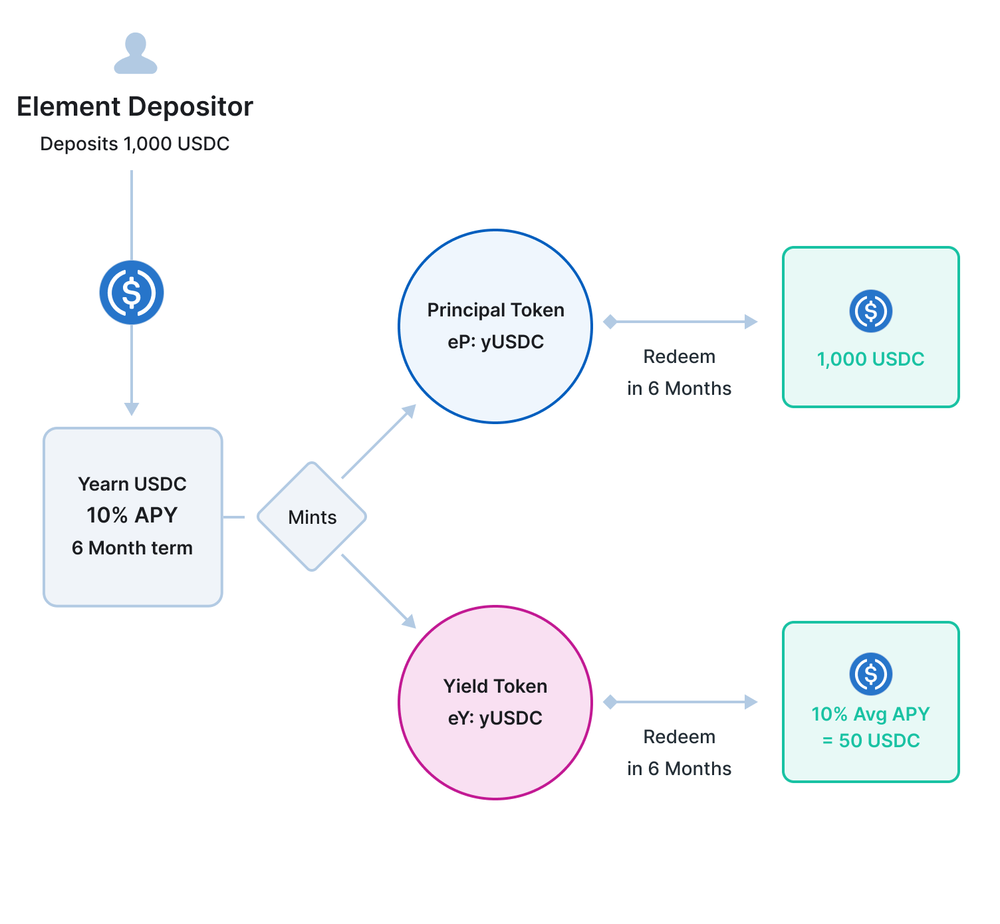
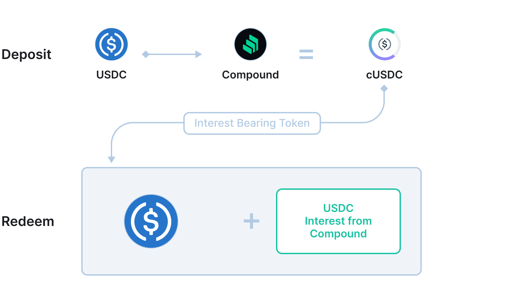

# Concepts Overview

### The Core Construct

The Element Protocol, at its core, works by enabling users via the Ethereum contracts to split the base asset (ETH, BTC, USDC, DAI) of yield generating positions, such as a Yearn vault or an ETH2 validator, into two separate, fungible tokens: the Principal Token (PT), and the Yield Token (YT). One token represents the value of the base principal (called the Principal Token), and one token represents the variable interest gained from the yield generating protocol (called the Yield Token).

The difference between Element and current existing DeFi protocols is that Element strips away the interest bearing assets whilst popular lending and yield generating platforms keep it all under one token.

#### Compound

When a user deposits into Compound for example, they receive cUSDC and that token is redeemable for both the deposit as well as the interest earned from that deposit. **Element splits the two things apart.**

### Creating a Fixed-Rate Market

The two token split enables a wider degree of capital efficiency due to the secondary market available to trade these different components.

If a user opts to exit out of their base deposit position and maintain exposure to the variable interest earned by that base deposit, they may choose to **sell** their Principal Tokens in the AMM.

However, because the principal tokens are not redeemable until the term period is over, the principal tokens will naturally trade a discount relative to the underlying asset. The discounted rate, when purchased, determines a fixed rate of return as the principal token eventually converges to a 1:1 value to the underlying asset.

**The Fixed Rate is earned from the purchasing of discounted assets and having the certainty of knowing what the value of the asset will arrive at.**

Discounted assets allow users who are risk-averse to take on a safe guaranteed investment strategy without having to worry about the fluctuations of the variable interest market.

### Variable Interest Flexibility

With the Yield Tokens being fungible, users have the ability to take higher exposure to variable interest. A yield token for a 10% APY on 1 ETH will pay out 0.1 ETH annually. A user can opt to increase exposure to a large sum of yield tokens before maturity and earn the remaining variable interest accrued during that term period.

By performing this action, the user facilitates exit liquidity for a seller to recognize their gains in the form of current accumulated yield.

A user who wants to utilize the entire value of their capital towards variable interest, can do so and gain a very high return if the average APY of the vault utilized stays consistent.
