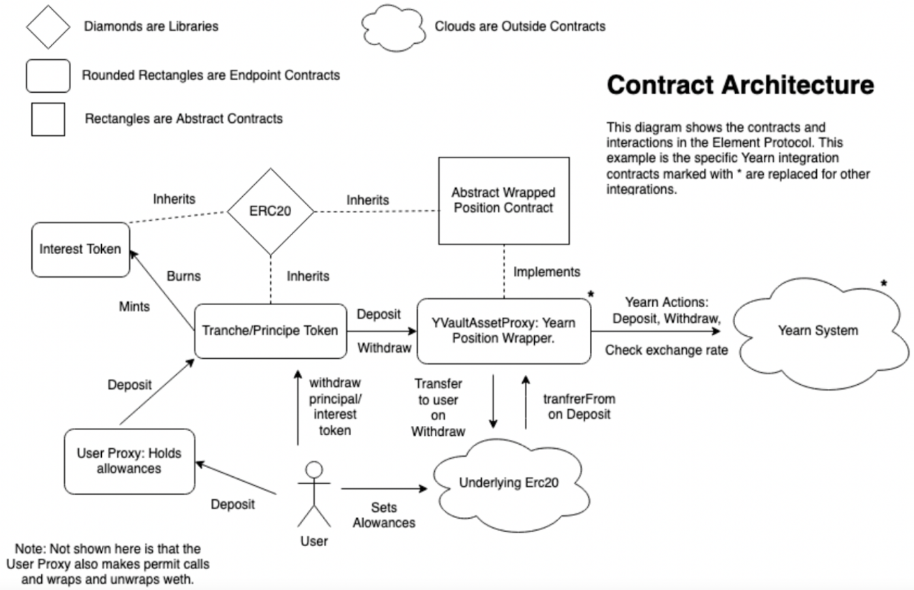

# Market Forces

High fixed rate yield is subsidized by the market forces described below. In short, the casual user subsidizes the active DeFi user's strategies by securing a fixed rate yield at a discount on what the DeFi user earns. 

Different forces in the market affect the opportunities that present themselves on Element. The active DeFi user’s participation subsidizes the value of the fixed rate yield. Depending on where the fixed and variable rates are in terms of demand, we can explore how these all affect profitability on both sides. Below are various examples of market forces. 

For an in-depth explanation of the various Market Forces, you can read this [**section**](https://paper.element.fi/#5-market-forces) of our Construction Paper.

### Increased Buying Demand for Fixed Rates

When the buying demand for fixed rates \(principal tokens\) increase, the discounted market rate begins to lower. This means that users who want to increase their exposure to variable interest will sell less of their total assets in order to attain capital. 

This makes processes such as [**Yield Token Compounding** ](https://medium.com/element-finance/intro-to-yield-token-compounding-40a75a11e18c)even more profitable. 

### Increased Selling Supply for Fixed Rates

When the protocol experiences large amounts of selling demand in the form of principal tokens, the discounted rate increases. This increases the guaranteed fixed rate income a buyer would receive for making the principal token purchase.

When variable interest rate increases in the underlying vault strategy, the acceptable discounted rate of selling fixed rates also increase. The relationship between variable interest and fixed interest is inverse, and Element allows users to effectively short the position of one interest rate to long the other.

### Increased Use Case of Principal Tokens

Element's primitives allow for usability that extends beyond fixed and variable rates. Through the development of products and trading, the increased utility of fixed rate-bearing instruments brings trading volume for users to earn higher fees by providing liquidity into the AMMs.

### Summarizing the Market Forces

The below diagram provides an overview visualization of all the market forces affecting both Yield and Principal Tokens. It is expected that sophisticated strategies will use knowledge of the various market forces represented in the diagram to realize higher profits.

### **Automated Strategies**

The following diagram is essentially a state machine diagram that represents the decisions that automated strategies or bots will analyze within the Element Protocol and the respective market forces:

##  

