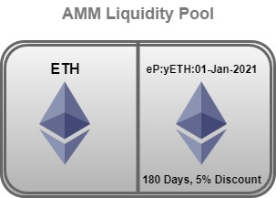
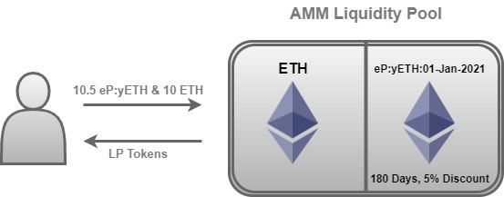

# Providing Liquidity

Element's Principal Tokens and Yield Tokens are tradable within the custom Balancer AMMs. A typical liquidity pool holds the principal token paired with it's underlying asset \(eP:yETH and ETH\). Each term period has its own liquidity pool that corresponds to the maturity date of the principal token. 

### Term Period

The AMM's reach maturity at the end of the set term period. Term periods vary in duration such as 90 days and 180 days. 

### User Flow

Users who want to provide liquidity into the AMMs can provide assets matching the term period as well as the paired asset within that liquidity pool. 

### Maturity

At maturity, eP:yETH will be redeemable 1:1 for ETH. Therefore when the user turns in their LP tokens into the AMM to withdraw their assets, the principal tokens and ETH are all worth the same value, and this removes any possibility of impermanent loss. 

