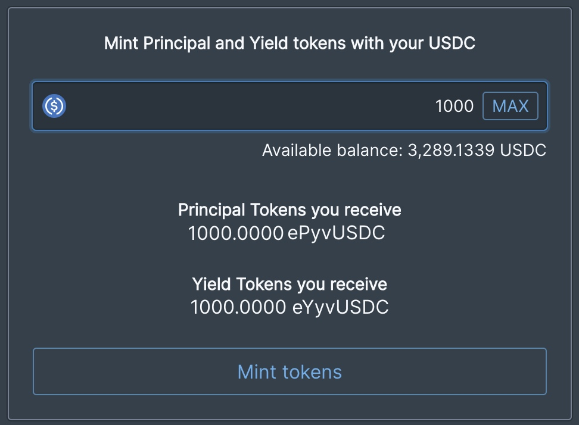

# Earning Variable Rates

## How do I earn a Variable Rate on Element?

Users are able to enter a variable rate position by **DEPOSITING** their base asset into one of Element's vaults and **MINTING** Principal and Yield Tokens. The Principal and Yield Tokens are both standard ERC-20 tokens that are tradable.&#x20;

## How much will I earn?

The amount of variable yield you will earn is based on the average APY of the vault you select for the term period. The Vault APY differs from asset to asset, and the users may choose which Principal and Yield tokens they would like to Deposit and Mint into.&#x20;

## Is there a minimum or maximum amount to deposit?‌

There is no minimum or maximum limit. However, when making small deposit amounts, it is important to account for transactional fees and expenses in order to properly calculate expected earnings.

## What are Yield Tokens?

Yield Tokens are minted and issued to **depositors** of the Element protocol when they have selected a term lockup period. The Yield Tokens are redeemable for the variable interest accumulated by the underlying vault strategy during the Term Period.

## What are Terms?

Terms are periods of time that the users choose to have their assets generating variable yield in the Element Protocol.‌

Although the Element Protocol smart contracts allow for any term to be created, it is expected that users and openly available frontends will encourage certain term conventions in order to concentrate liquidity.&#x20;

For example, users may collectively decide to actively support both 3 and 6-month terms released every month and a half. The contracts are open for anyone to integrate or launch a term with. This means the community of users will ultimately decide which terms they would like to support. This could be through a DAO or through other products that are built.

## How do I exit my Term?‌

For a user to exit their Term, they may opt to sell their issued Principal Tokens on the secondary market. The liquid secondary market allows users to enter and exit their term positions at any time. Additionally a user may exit their term by redeeming the Principal or Yield Tokens at maturity.

## Where does the variable yield come from?

The variable interest rate for the current user deposits are sourced from [Yearn vault strategies](https://yearn.finance/vaults).
