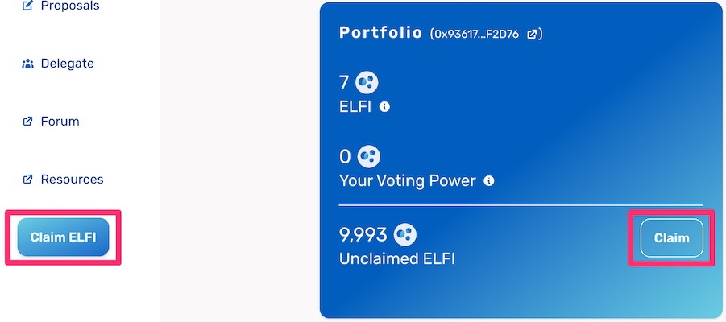
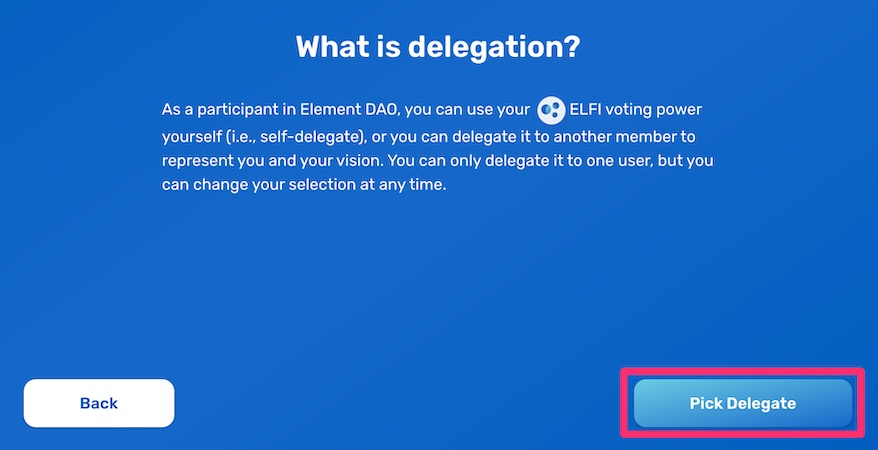
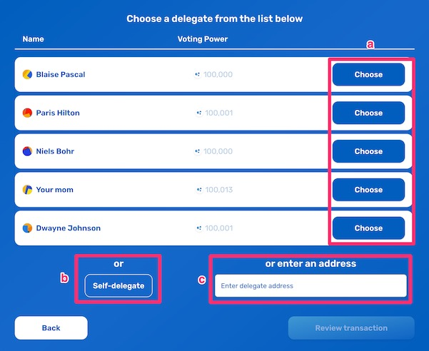
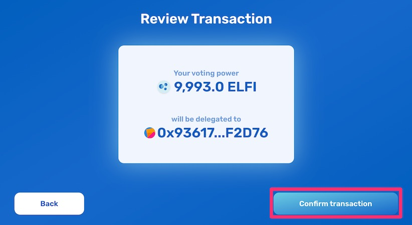

## Airdrop Claim Flow

### Who can claim voting power?

You may be eligible to claim voting power if you’re included in any of the following groups:

* **Early users of Element Finance:** Individuals that used the Element protocol to LP, Trade, or Mint 
* **Community contributors:** Users who have engaged in meaningful conversations on Element’s Discord server.
* **Ecosystem contributors:** Builders who have contributed to the public goods infrastructure that keeps the Ethereum blockchain running

This guide is for retro recipients who were users of the Element Protocol. If you were part of the ecosystem or community contributors, please follow those appropriate guides:

* [Discord Airdrop Claim Guide (Community contributors)](https://docs.element.fi/governance-council/airdrop/discord)
* [GitHub Airdrop Claim Guide (Ecosystem contributors)](https://docs.element.fi/governance-council/airdrop/github)

### How to claim voting power?

1. Go to [Element’s Council Dashboard](https://gov.element.fi/) and **connect your wallet**.

2. If you’re eligible, you’ll find a **Claim** button along with your claimable amount in the ‘Portfolio’ section of this page, along with another one in the sidebar menu.

3. After a couple of informational screens regarding eligibility and your specific claimable amount, you’ll be asked to pick a delegate to assign your voting power (you can pick yourself or another community member).

4. You can choose one of three options:
	* a. **Select** a delegate from the list of ‘Featured Delegates’
	* b. **Choose** yourself as a delegate (self-delegate)
	* c. **Enter** a valid wallet address to delegate your votes. 

5. After choosing your delegate, you’ll be asked to review the amount of voting power to claim and the address of the delegate. This will prompt a blockchain transaction, requiring you to pay for gas.

With this transaction you’ll claim your ELFI, automatically depositing them into the locking Voting Vault. The voting vault, containing your ELFI, will now allow you to exercise your voting power on proposals.

6. After **confirming your transaction** in your web3 wallet, you’ll see a confirmation screen. Congratulations, you have successfully claimed and delegated your voting power!

### What’s next?

Now that you’ve claimed your voting power, your delegate (or you, in case of self-delegation) can use your voting power to vote on proposals. 

* Explore the [Proposals](https://gov.element.fi/proposals) page to stay updated on all new developments
* Head to the [Delegate](https://gov.element.fi/delegate) page to review or change your delegation
* Learn more about how Voting Vaults work
