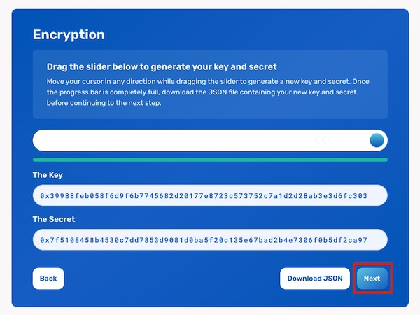

## Discord ZK Claim Flow

This guide is for **Community contributors**. To see if you are eligible, please review our post on distribution. Community contributors are users who engaged in meaningful conversations in our Discord community.

### How to claim my Discord-based airdrop?

1. Go to the [Discord Airdrop Dashboard](https://gov.element.fi/zk/discord/).

2. Make sure you read the instructions on:

	* How to Generate your Key, Secret, & Public ID 
	* How to Share your New Public ID on Discord
	* How to Check your Eligibility

3. After reading the instructions and ensuring that your wallet is connected, click on **Get Started** on the bottom right-hand side.

    

4. **Click and drag** the slider in any direction until the progress bar turns green. This will generate a random Key and Secret,based on your trackpad (or mouse) movements. Once ready, click on **Download JSON**. Make sure that you save the JSON file in a secure location. You will need both your Key and Secret to check if your Discord ID was eligible.

    

5. After downloading the JSON file, the **Next** button will become enabled. Click **Next**.

    

6. Once you see the message “Public ID Successfully Created,” copy the Discord Command by clicking on **Copy**. Click on **Go to Discord**.

    

7. **Paste** the Discord Command you have copied into the Discord-Claim channel in the Element Discord server. 

    Make sure that you see the /submitpublicid message on the screen. This means that the bot has recognized the command. Finally, **press the enter (or return) key** on your keyboard.

    

### What’s next?

On April 6th, 2022, we’ll announce the link where you can check your eligibility and claim your voting power.

Once you’ve claimed your voting power, it can be used by your delegate (or yourself, in case of self-delegation) to vote on proposals. 

* Explore the [Proposals](https://gov.element.fi/proposals) page to stay updated on all new developments
* Head to the [Delegate](https://gov.element.fi/delegate) page to review or change your delegation
