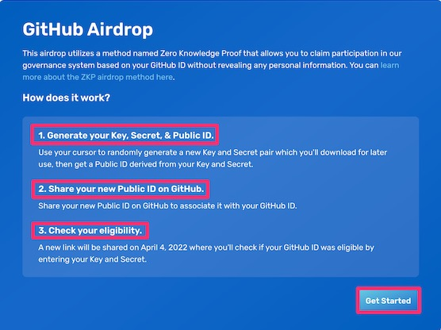
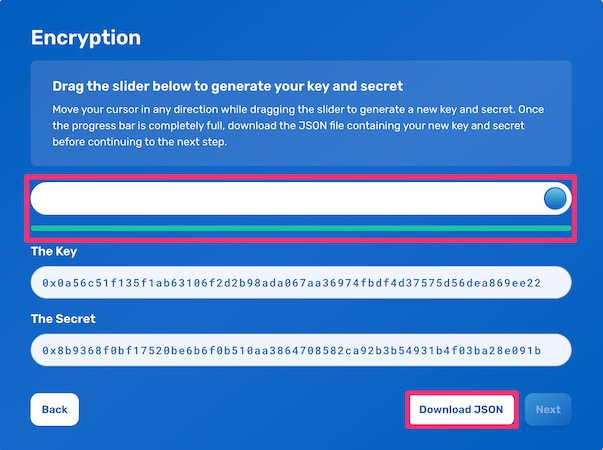
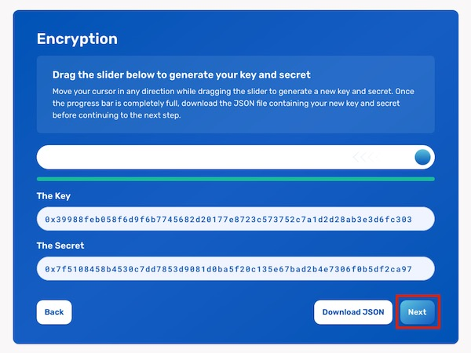
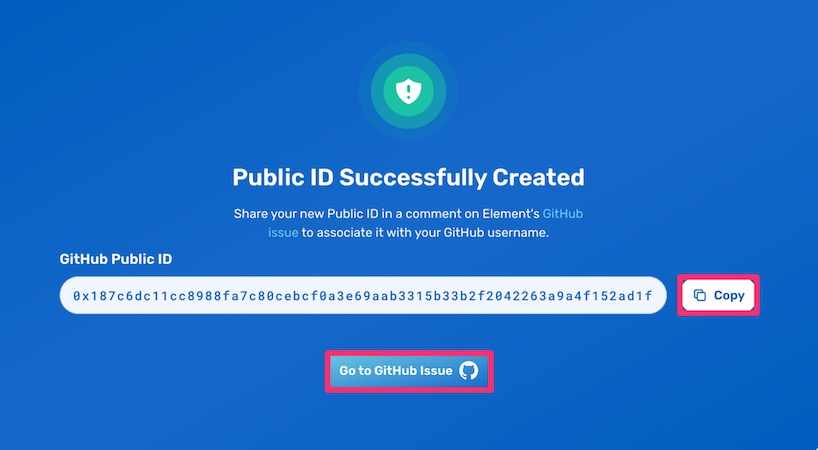
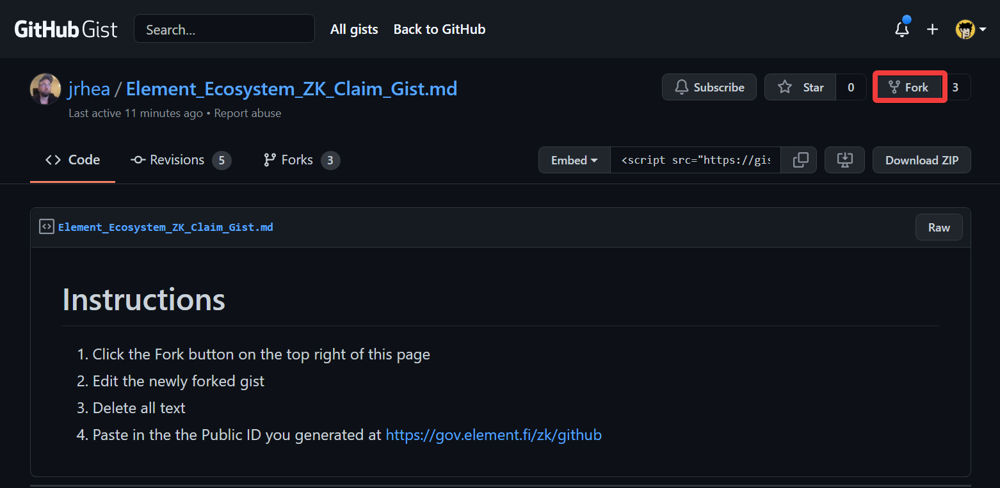
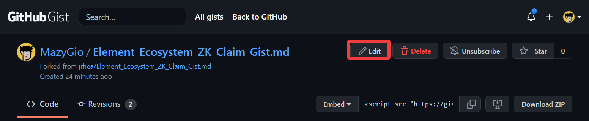
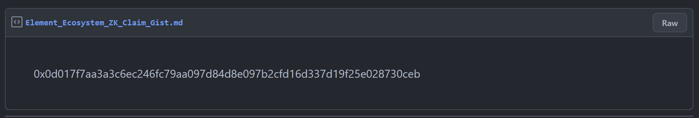

## GitHub ZK Claim Flow

This guide is for **Ecosystem contributors**. Ecosystem contributors are those who have worked on building the public goods infrastructures that power the entire ecosystem of dapps and protocols on the Ethereum blockchain. To find out if you're eligible, please check if you've contributed to any of the [eligible repositories](https://gist.github.com/mihai6/6f5e7d5c7d28c39f122a1d76719e0d0c) before March 1st, 2022.

* **Note**: If you already followed our ZK Claim Flow and submitted a comment to our GitHub [Issue #384](https://github.com/element-fi/elf-council-frontend/issues/384) or [Issue #724](https://github.com/element-fi/elf-council-frontend/issues/724), then you don't need to follow this guide or do anything else. Your submission is already secured, see you on April 11th! Otherwise, please read on.

### How to claim my Github-based airdrop?

* Go to the [Github ZK Claim page](https://gov.element.fi/zk/github/).

* Make sure you read the instructions on:

	* How to Generate your Key, Secret, & Public ID 
	* How to Share your New Public ID on GitHub
	* How to Check your Eligibility

    Once you’re ready, click the **Get Started** button on the lower right corner of the page.

* **Click and drag** the slider in any direction until the progress bar turns green. This will generate a random Key and Secret,based on your trackpad (or mouse) movements. Once ready, click on **Download JSON**. Make sure that you save the JSON file in a secure location. You will need both your Key and Secret to check if your GitHub ID was eligible.

* After downloading the JSON file, the **Next** button will become enabled. Click **Next**.

* Your Public ID has now been created! Copy your Public ID and click on the **Go to GitHub Gist** button. This will take you to Element’s GitHub repository.

* **Fork** this Github Gist using the **Fork** button on the upper right corner of the page.

* **Edit** the newly forked gist by clicking the **Edit** button on the top section of the page.

* Erase all the text and paste the Public ID you generated and copied in the previous steps and click the **Update public gist** button below the lower right corner of the gist content. You can always your Public ID again in the JSON file you downloaded in the previous steps.

* Congratulations! You have now submitted your Public ID. Public IDs will be collected until April 11, 2022, after which we'll provide a new link to check if your GitHub ID was eligible using your key and secret. Keep them private and don't lose them! The new link will be shared here, on Twitter, and in our Discord server. If you miss out on the first collection process, don't worry, we'll do additional collection periods.

    A reminder, the ZK claim process lets you maintain your privacy. Your Ethereum address cannot be doxxed.

### What’s next?

Wait until April 11th, 2022 and check your eligibility for the airdrop. If eligible, you’ll be led through a Claim process, very similar to the [Airdrop Claim Flow](https://docs.element.fi/governance-council/airdrop).

Now that you’ve claimed your voting power, it can be used by your delegate (or yourself, in case of self-delegation) to vote on proposals. 

* Explore the [Proposals](https://gov.element.fi/proposals) page to stay updated on all new developments
* Head to the [Delegate](https://gov.element.fi/delegate) page to review or change your delegation
