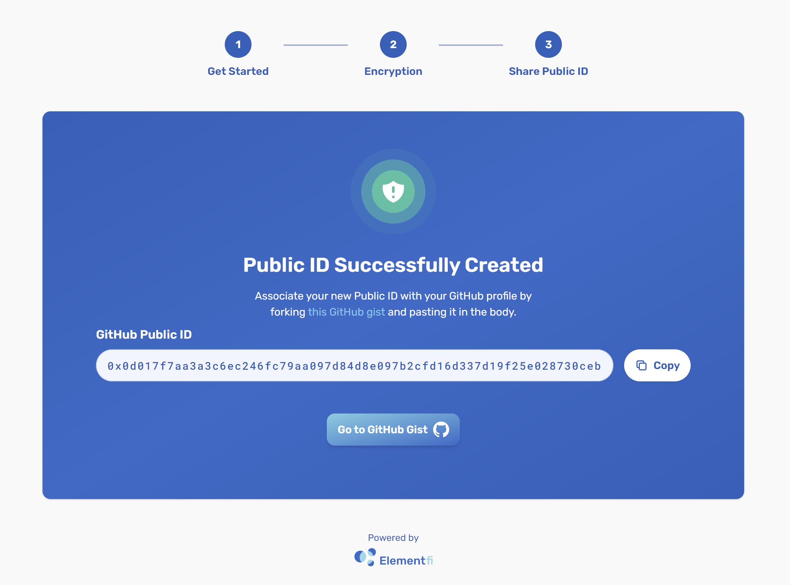

## GitHub ZK Claim Flow

This guide is for **Ecosystem contributors**. Ecosystem contributors are those who have worked on building the public goods infrastructures that power the entire ecosystem of dapps and protocols on the Ethereum blockchain. To check if you are eligible, please review our distribution post.

### How to claim my Github-based airdrop?

1. Go to the [Github ZK Claim page](https://gov.element.fi/zk/github/).

2. Make sure you read the instructions on:

	* How to Generate your Key, Secret, & Public ID 
	* How to Share your New Public ID on GitHub
	* How to Check your Eligibility

    Once you’re ready, click the **Get Started** button on the lower right corner of the page.

    

3. **Click and drag** the slider in any direction until the progress bar turns green. This will generate a random Key and Secret,based on your trackpad (or mouse) movements. Once ready, click on **Download JSON**. Make sure that you save the JSON file in a secure location. You will need both your Key and Secret to check if your GitHub ID was eligible.

    

4. After downloading the JSON file, the **Next** button will become enabled. Click **Next**.

    

5. Your Public ID has now been created! Copy your Public ID and click on the **Go to GitHub Issue** button. This will take you to Element’s GitHub repository.

    

6. **Paste** your Public ID as a comment in the GitHub Issue (GitHub Airdrop #384) and click on the **Comment** button to post it.

    

7. Congratulations! You have now submitted your Public ID. You’ll now have to wait until April 6, 2022, the date when we’ll share another link for you to check your eligibility and, if eligible, claim your airdrop.

### What’s next?

Wait until April 6, 2022 and check your eligibility for the airdrop. If eligible, you’ll be led through a Claim process, very similar to the [Airdrop Claim Flow](https://docs.element.fi/governance-council/airdrop).

Now that you’ve claimed your voting power, it can be used by your delegate (or yourself, in case of self-delegation) to vote on proposals. 

* Explore the [Proposals](https://gov.element.fi/proposals) page to stay updated on all new developments
* Head to the [Delegate](https://gov.element.fi/delegate) page to review or change your delegation
