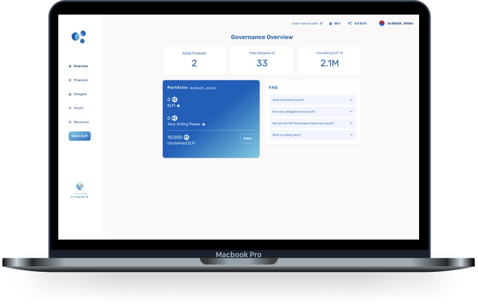

## Overview Page

The interface for governance is live at **[gov.element.fi](https://gov.element.fi/)**

Here you can earn, claim ELFI and see your current Council portfolio.

To claim your ELFI click on the Claim button. You can now claim your ELFI and delegate voting power to community members that have been nominated (including those that have self-nominated) in hopes of becoming a GSC member, and in turn playing a significant role in protocol. At the end of this initial claim flow, you will have the ability to change your initial delegation on the ‘Delegate’ page. 

You also have the ability to view contextual information that will help inform your decisions and further your knowledge of the Council protocol when voting, delegating, or taking part in any other governance-related matters.