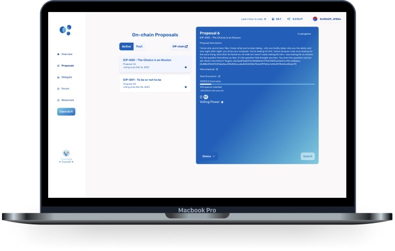

## Proposals Page

You can review proposals that are active and still open for voting, as well as past proposals.

To view proposals that are open for voting, you can currently click on the ‘Active’ toggle button on the top right-hand side of the page. After doing so, you can now select the desired proposal and view the ‘Proposal Description,’ and view both a link to the proposal on Snapshot and a link to the proposal discussion on the forum in Commonwealth.

You can view your personal voting power (including what others have delegated to you) in relation to a given proposal and how many more votes are required for the proposal to reach quorum.