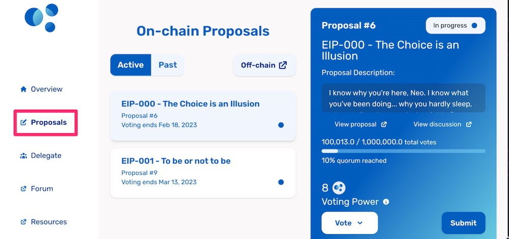
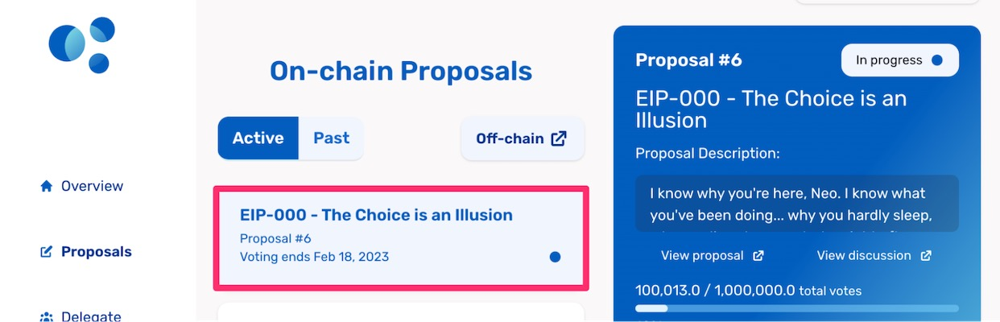
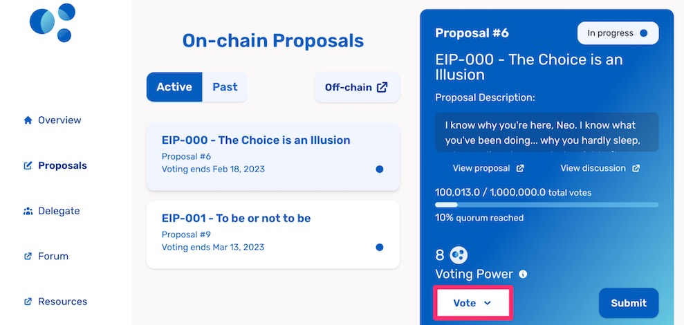
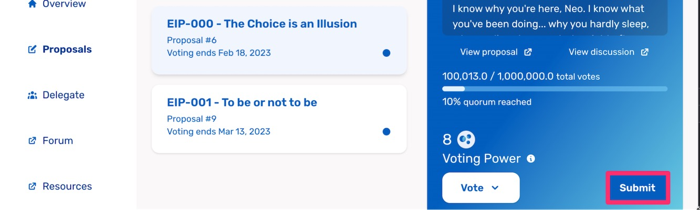

## Guide: Voting on a proposal

Your voting power lets you vote on key changes to the Element Protocol that are proposed by the community. Everyone with voting power has a say in the future of the Protocol.

### Who can vote?

Every member who holds voting power can vote on proposals. 

You hold voting power if you have claimed it and delegated it to yourself, or had voting power delegated to you by another governance participant.

You don’t hold voting power if you have claimed it and delegated it to another governance participant. In this case, you can’t directly vote on proposals, but your delegate can vote on your behalf.

### How to vote

* Go to the [Element Council’s Proposals page](https://gov.element.fi/proposals/) and **connect your wallet** on the top right-hand side.

* **Select** the proposal you’re interested in, from the list of proposals. Note that you can only vote on Active proposals.

* You can find all the information about your selected proposal in the right side pane. Once you’ve made your decision, use the Vote button on the lower side of the pane and select one of the voting options.

* Once you’ve made your selection, click the Submit button on the lower right-hand corner of the pane to confirm your vote. This will trigger an on-chain transaction, so you will have to confirm it in your web3 wallet, and pay for any associated gas fees.

### What’s next?

Congratulations, you’ve voted on a governance proposal! You can continue to the links on the Proposals page to look at the discussions around the proposal and review past proposals.