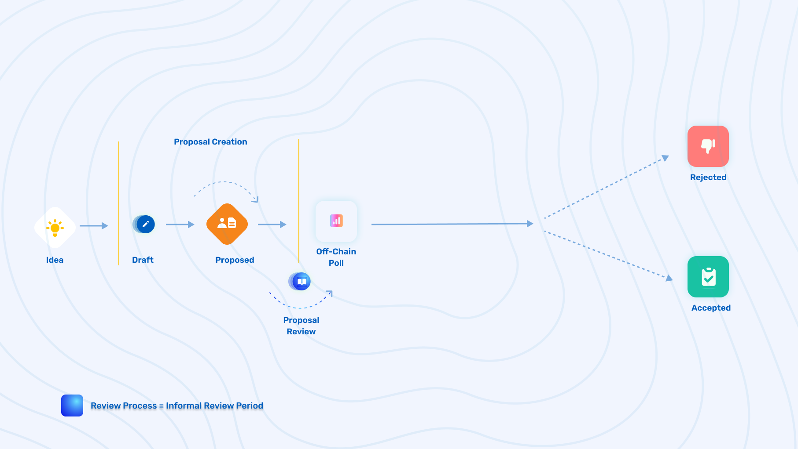

# DAO (Social) Proposal Lifecycle Breakdown & Criteria

## DAO (Social) Proposal Lifecycle Breakdown & Criteria

### **Official Status Lifecycle for a DAO (Social) Proposal**

\[Idea] ➡️ \[Draft] ➡️ \[Proposed] ➡️ \[Off-chain Poll] ➡️ \[Accepted/Rejected]

### **Official Status Lifecycle for a DAO (Social) Proposal (including review periods)**

\[Idea] ➡️ \[Draft] ➡️ \[Proposed] ➡️ \[Review] ➡️ \[Off-chain Poll] ➡️ \[Accepted/Rejected]

### **Idea**

* The **Idea** status is an informal stage of the lifecycle of an ElementDAO governance proposal. This is when an idea is seeded for a proposal and has been posted on Discord, the Commonwealth forums, or even Twitter.

### **Draft**

* The **Draft** status is a formal status on the Commonwealth forums, where a proposal has been created using the provided template in hopes of getting support and feedback from the community. Based on community feedback, the author of the proposal should make updates and edits to the proposal. The goal of the`Draft` proposal status is to get enough feedback and support to achieve soft consensus in order to confidently proceed with a formal proceed without it getting immediately shot down. The draft proposal status also helps avoid having “garbage proposals” make it through to Off-chain polls and helps eliminate voting fatigue that the community would face without this stage.
* Once posted on the governance forum as a **Draft**, all questions and comments should be addressed and taken into consideration, to further improve the proposal before moving to the next stage. If they are ignored, it is less likely for the proposal to pass the Off-chain Poll.

### **Proposed**

* The **Proposed** status is a formal status on the Element Commonwealth forums, where a proposal has officially been submitted to proceed to the Off-Chain Poll stage after the dedicated review period. If the Draft proposal did not contain any official code and just a specification, this proposal would include the exact code that will be executed. This way anyone could verify the hash that is included on-chain.
* Once a proposal has been submitted under this status, it will officially be given an ID. IDs are given based on increments of submission. For example, the first proposal will be `[EGP-1]: Title of Proposal`. The second proposal would be `[EGP-2]: Title of Proposal` and so on.

### **Review Period (not an official proposal status)**

* The **In-Review** status is a formal status on the Element Commonwealth forums, where a proposal sits in review for the community to discuss and prepare for the upcoming **Off-Chain Poll.** A proposal that has completed the **review period**, will proceed to a final Off-chain poll (Snapshot).
* `DAO (Social) Proposals Review Period`: 1 week

### **Off-Chain Poll (Snapshot)**

* The **Off-Chain Poll** status is a formal status on the Element Commonwealth forums. Off-chain polls can be voted on in the forums (embedded Snapshot) or directly on the [Element Snapshot page](https://snapshot.org/#/elfi.eth) and will ultimately decide if a DAO proposal is accepted or rejected by the community.
* **Note:** From the launch of governance, the admins of Snapshot will coordinate the off-chain polling until the GSC takes it on or the DAO decides to onboard a governance contributor or team to fill the role. In the future, it would make sense to use a multisig with a single account threshold to add an off-chain proposal. This way any member of the GSC would be able to add a proposal.

### **Accepted/Rejected (Final Status for DAO Proposals)**

* The **Accepted/Rejected** status is the final state of a proposal after being voted on. If it passes, it is officially accepted by the community (with actions of the proposal being implemented) and is given the Accepted status. If not, the proposal is rejected and labeled as such.

