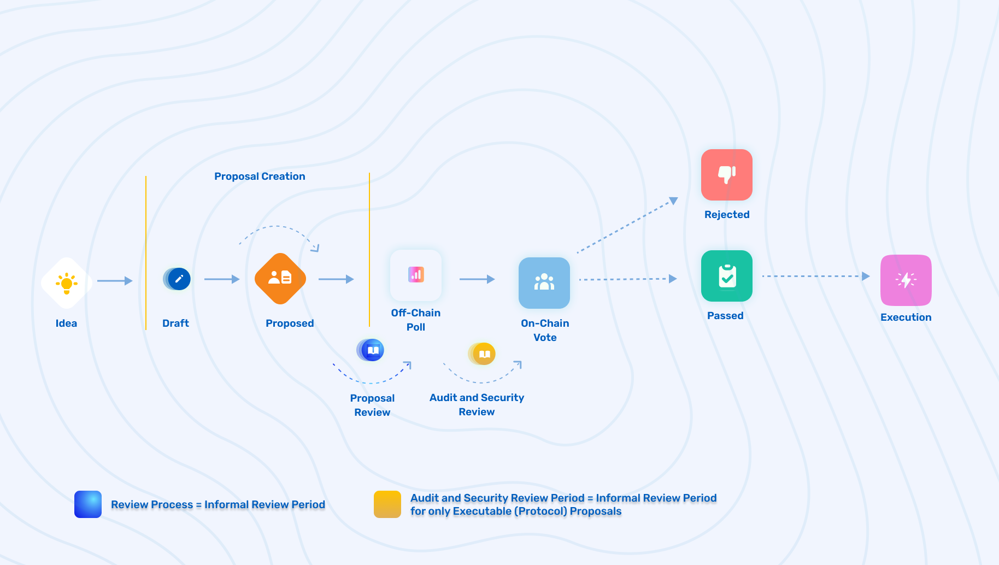

# Protocol (Executable) Proposal Lifecycle Breakdown & Criteria

## Protocol (Executable) Proposal Lifecycle Breakdown & Criteria



### **Official Status Lifecycle for a Protocol (Executable) Proposal**

\[Idea] ➡️ \[Draft] ➡️ \[Proposed] ➡️ \[Off-chain Poll] ➡️ \[On-chain Vote] ➡️ \[Accepted/Rejected] ➡️ \[Execution]

### **Full Lifecycle For A Protocol (Executable) Proposal (including review periods)**

\[Idea] ➡️ \[Draft] ➡️ \[Proposed] ➡️ \[Review] ➡️ \[Off-chain Poll] ➡️ \[Review] ➡️ \[On-chain Vote] ➡️ \[Accepted/Rejected] ➡️ \[Execution]


### **Idea**

* The **Idea** status is an informal stage of the lifecycle of an ElementDAO governance proposal. This is when an idea is seeded for a proposal and has been posted on Discord, the Commonwealth forums, or even Twitter.

### **Draft**

* The **Draft** status is a formal status on the Commonwealth forums, where a proposal has been created using the provided template in hopes of getting support and feedback from the community. Based on community feedback, the author of the proposal should make updates and edits to the proposal. The goal of the`Draft` proposal status is to get enough feedback and support to achieve soft consensus in order to confidently proceed with a formal proceed without it getting immediately shot down. The draft proposal status also helps avoid having “garbage proposals” make it through to Off-chain polls and helps eliminate voting fatigue that the community would face without this stage.
* Once posted on the governance forum as a **Draft**, all questions and comments should be addressed and taken into consideration, to further improve the proposal before moving to the next stage. If they are ignored, it is less likely for the proposal to pass the Off-chain Poll.

### **Proposed**

* The **Proposed** status is a formal status on the Element Commonwealth forums, where a proposal has officially been submitted to proceed to the Off-Chain Poll stage after the dedicated review period. If the Draft proposal did not contain any official code and just a specification, this proposal would include the exact code that will be executed. This way anyone could verify the hash that is included on-chain.
* Once a proposal has been submitted under this status, it will officially be given an ID. IDs are given based on increments of submission. For example, the first proposal will be `[EGP-1]: Title of Proposal`. The second proposal would be `[EGP-2]: Title of Proposal` and so on.

### **Review Period (not an official proposal status)**

* The **In-Review** status is a formal status on the Element Commonwealth forums, where a proposal sits in review for the community to discuss and prepare for the upcoming **Off-Chain Poll.**
* `Protocol (Executable) Proposals Review Period`: 1 week

### **Off-Chain Poll (Snapshot)**

* The **Off-Chain Poll** status is a formal status on the Element Commonwealth forums and can be voted on directly in the forum or directly on the Element Snapshot page ([link](https://snapshot.org/#/elfi.eth)). A proposal that has completed the **review period**, will proceed to an Off-chain poll (Snapshot). The main requirement of a Protocol proposal on Snapshot is to include Calldatas and Targets should be included to verify the on-chain proposalHash when it is created.
* The goal of the Off-Chain Poll is to gather community sentiment towards the proposal and gather feedback to direct the preferred path. This Poll allows the community to reach a rough consensus to maximize the chances of a positive outcome of the On-chain vote submission.
* **Note:** From the launch of governance, the admins of Snapshot will coordinate the off-chain polling until the GSC takes it on or the DAO decides to onboard a governance contributor or team to fill the role. In the future, it would make sense to use a multisig with a single account threshold to add an off-chain proposal. This way any member of the GSC would be able to add a proposal.

### **Review Period (not an official proposal status)**

* This review period is for Protocol proposal code review. If the code is already audited it may be a short period of time but if the audit or review has not started, the proposal should not move to an on-chain vote until it has been complete. The review period is meant to start out as flexible but may become more strict as the governance process evolves. Transparency and communication is encouraged by the proposal author during this stage.

### **On-chain Vote**

* The **On-chain Vote** status is a formal status on the Element Commonwealth forums where proposals can be voted on directly on the official Element governance [dashboard](https://gov.element.fi).

### **Accepted/Rejected**

* The **Accepted/Rejected** status is the final state of a proposal after being voted on. If it passes, it is officially accepted and is given the Accepted status. If not, the proposal is rejected and labeled as such.

### **Executable/Executed (For Protocol Proposals only)**

* Once a proposal has reached the winning quorum (specific number), the proposal may be executed. This status states that the proposal is ready to be officially executed.

## Protocol (Executable) Proposal Template

```markdown
EGP#: <# to be assigned>
Title: <EGP title>
Author(s): <list of authors' names and/or Twitter/GitHub handles>
Type: Protocol Proposal
Status: <Assigned by GSC or Forum moderators >
Date Proposed: <yyyy-mm-dd>
Date Ratified: <yyyy-mm-dd>
```

### **References**

* A list of supporting materials referenced by this EGP.

### **Sentence Summary**

* A description of what the Element Governance Proposal (EGP) is focused on in 30 words maximum.

### **Paragraph Summary**

* A description of what the Element Governance Proposal (EGP) is focused on.

### **Motivation**

* A short description of the motivation behind the proposed technical feature, solution, or upgrade.

### **Specification**

Describe the details of the proposed technical solution. The specification should be detailed enough to allow an implementation to begin as well as testing. The specification for technical EGPs must include the following components:

#### **Proposed Code**

* The final code that could be used directly in the on-chain vote to execute the EGP.

#### **Test Cases**

* For the implementation or testing of the proposed code.

#### **Security Considerations**

* This section is to include or (proactively document) any security-relevant design information, potential failure modes, implementation details, and important discussions related to the proposed change.

#### Technical Review Plan or **Audit Information (If already available)**

* This section is to include the process for reviewing and auditing the code. If there are no audits available yet, describe the plan for it. A Protocol proposal should NOT move to a final vote without being reviewed/audited. Therefore, it is recommended to be as detailed as possible in this section.

#### Next Steps (Voting Outcome Summary)

* Clearly outline the next steps for this proposal. This includes a recommended review period for the technical solution, what voting “yes” and “no” entails, and what the outcome and next steps would be if the proposal were to pass the Off-Chain Poll and On-Chain Vote.
* **For example:**
  * Discuss this proposal on the forum and discord.
  * Implement a poll on this proposal on Snapshot.
    * If passed: This proposal will move to an audit review period.
  * A code review process will take X and should not be moved to an On-Chain vote before it has been deemed safe.
  * Implemented a vote on this proposal on Element Governance Dashboard
    * If passed: This proposal will be executed and the following will be implemented to the Element Protocol or the Element Council Protocol.

